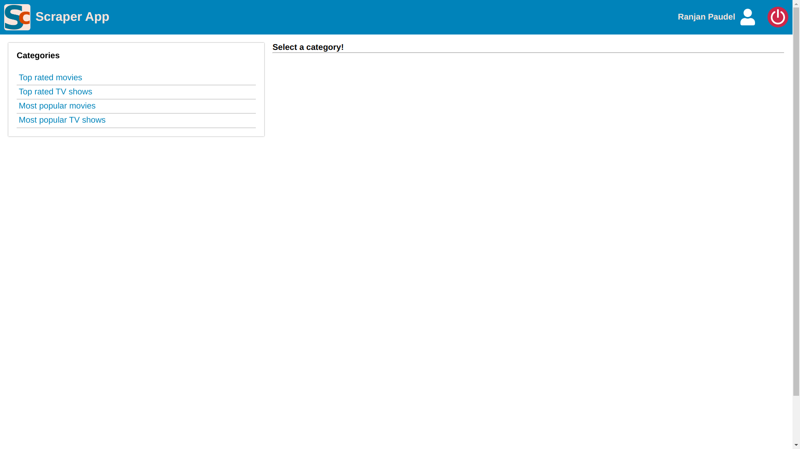

# IMDb Scraper: A Flask App
Simple Server-side-rendering web-app(Python) in Flask. An authorized user can scrape (or update the scraped data of) four IMDb pages:<br />
[Top Rated Movies](https://www.imdb.com/chart/top/?ref_=nv_mv_250)<br />
[Most Popular Movies](https://www.imdb.com/chart/moviemeter/?ref_=nv_mv_mpm)<br />
[Top Rated TV Shows](https://www.imdb.com/chart/toptv/?ref_=nv_tvv_250)<br />
[Most Popular TV Shows](https://www.imdb.com/chart/tvmeter/?ref_=nv_tvv_mptv)

## Install
Clone the repo.
```
# clone this repo
$ git clone https://github.com/mrranjan31paudel/lf-training.git
$ cd Python/RanjanPaudel/scraper
```
Create a virtual environment and activate it. (Recommended)
```
$ python3 -m venv scraper_app_venv
$ source scraper_app_venv/bin/activate

----Or in Windows cmd----
$ scraper_app_venv\Scripts\activate.bat
```
Install packages from requrements.txt.
```
$ python3 -m pip install -r requirements.txt
```
## Setup
Install mysql in your system (Follow [this guide](https://dev.mysql.com/doc/mysql-installation-excerpt/5.7/en/)).<br />
After the installation is complete, copy `.env.example` as `.env`:<br />
```
$ cp .env.example .env
```
Then set the parameters as per your requirement.<br />
To run the migrations, first create database `scraper_app` for development and `scraper_app_test` for test. Then use the simple migrating CLI app:
```
$ python3 scraper_app/db_migrator.py --env {test|development} --action {create|drop}
```
*You can use: `$ python3 scraper_app/db_migrator.py --help` for detailed info about the CLI migrator-app.*
## Run
### Mode: Development
In the terminal do:
```
$ export FLASK_ENV=development
$ export FLASK_APP=scraper_app/app.py
$ flask run
```
### Mode: Test
This is used to perform the unit-tests in the `/tests` folder. For this you just have to do:
```
$ pytest -s
#'-s' to show the logs of test passings.
```
## Some screenshots





